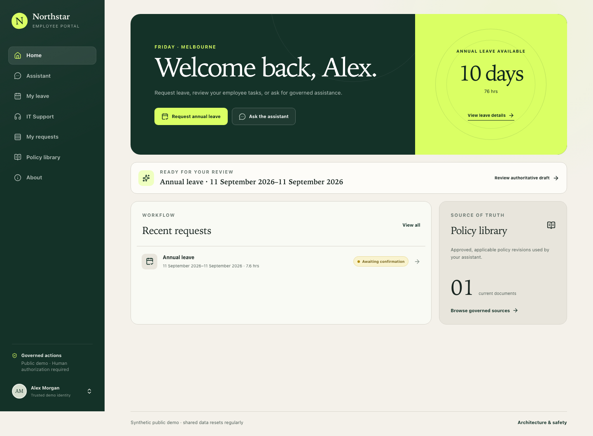

# Enterprise AI Knowledge & Action Agent

A production-minded portfolio prototype showing how probabilistic AI can prepare enterprise work while deterministic systems retain authority over execution.

[**Live Demo**](https://enterprise-ai-demo-portal.onrender.com/) · [Architecture](docs/architecture.md) · [Engineering Case Study](docs/case-study.md) · [Project History](docs/project-history.md)

> The deployed portal uses shared synthetic identities and synthetic business systems. Do not enter personal, confidential, password, or employer information.



## What this demonstrates

- Authority-aware RAG with approved/effective/applicable filtering before vector ranking.
- Versioned governed citations to exact document revisions and sections.
- Provider-native READ/PREPARE tool calling; the model has no execution tool.
- Persisted authoritative drafts displayed directly by an independent Review surface.
- Revision-bound human authorization; chat “yes” cannot authorize.
- Deterministic Annual Leave and IT Support handlers behind a private worker.
- PostgreSQL transaction safety, concurrency controls, and lost-commit-ACK recovery.
- Owner isolation across two fixed synthetic employee identities.
- A public Next.js BFF in front of private FastAPI and worker services on Render.

The two domains share control-plane safeguards but retain explicit business rules. Annual Leave uses a sealed single draft and employee-level serialization. Editable IT drafts create immutable revisions and use a unique `source_action_id` for exactly-one ticket creation. “Exactly one” is limited to the business mutation inside the same PostgreSQL transaction boundary; it is not a universal distributed exactly-once claim.

## 90-second guided walkthrough

1. Open [the demo](https://enterprise-ai-demo-portal.onrender.com/) and read the synthetic-data disclosure.
2. On Home, note that employee tasks and current state lead; Assistant is a supporting capability.
3. Ask the guided carry-over question and open its citation in Policy Library.
4. Ask Assistant to prepare annual leave for next Friday.
5. Inspect the persisted draft, then type “yes, submit it” in chat. Nothing executes.
6. Open the independent Review page, compare the exact dates/hours, begin authorization, and use the explicit submit control.
7. Open My Requests and the Action Detail audit evidence, then check the updated leave balance.
8. Review an IT Support draft, save an edited immutable revision, and observe that it requires a fresh challenge.
9. Switch Alex/Sam and confirm that balances, requests, and tickets remain owner-scoped.

Provider availability, shared quotas, and the periodic reset can limit public guided requests. Do not repeat destructive demo scenarios unnecessarily.

## Architecture and trust model

The browser talks only to the public Next.js portal/BFF. The BFF maps an HttpOnly persona cookie to a fixed synthetic demo session on the server, adds a server-only internal key, and calls private FastAPI. FastAPI resolves employee identity and owns applicability, workflow, and projection rules. PostgreSQL with pgvector is authoritative for governed knowledge, persisted action revisions, business results, quotas, readiness, and application-level audit evidence.

The action boundary is:

```text
Assistant PREPARE
  -> persisted authoritative draft
  -> independent Review
  -> revision-bound challenge
  -> explicit human authorization
  -> CONFIRMED
  -> private deterministic worker
  -> explicit HR or IT handler
  -> one PostgreSQL commit
  -> result + final state + audit evidence
```

See [Architecture and Trust Boundaries](docs/architecture.md) for the three maintained diagrams and precise claims.

## Key engineering decisions

- **Authority is not relevance.** Applicability filters use trusted context before semantic ranking.
- **Citations are server-built.** Retrieved text cannot invent document identity, version, or section authority.
- **Conversation is not consent.** Only a short-lived challenge bound to the persisted revision can confirm an action.
- **Generalize invariants, not business logic.** HR and IT share workflow controls but keep explicit handlers and locking rules.
- **Infrastructure is earned by the failure boundary.** The original V4 explored LangGraph-style orchestration, but the business side effect and workflow state share PostgreSQL. The live design uses explicit locks, constraints, a deterministic poller, and one atomic commit without claiming LangGraph was inherently unsuitable.
- **Public failure states are product states.** Quota, reset, corpus, migration, timeout, and worker health are projected safely through readiness.

Read the [Engineering Case Study](docs/case-study.md) and [public-safe Interview Notes](docs/interview-notes.md).

## Tech stack

| Area | Implementation |
|---|---|
| Portal | Next.js 16, React 19, TypeScript, Tailwind CSS |
| API | Python 3.12+, FastAPI, Pydantic |
| Data | PostgreSQL 17, pgvector, SQLAlchemy, Alembic |
| AI | Google Gemini via `google-genai`; provider-native tools and structured outputs |
| Runtime | Docker, Render private services, dedicated action worker |
| Validation | pytest, Ruff, ESLint, TypeScript, Playwright, GitHub Actions |

## Local setup

Prerequisites: Python 3.12+, [`uv`](https://docs.astral.sh/uv/), Node.js 22, npm, Docker, and Docker Compose.

```bash
uv sync --locked --dev
docker compose -f infra/compose.yaml up -d
uv run alembic upgrade head
```

Copy `.env.example` to `.env` only for local runtime use. Populate `GEMINI_API_KEY` through the environment; `.env` is ignored. Governed corpus ingestion makes real embedding-provider calls:

```bash
uv run enterprise-ai-ingest corpus
```

Start the private API and worker in separate terminals:

```bash
uv run uvicorn app.main:app --reload
uv run enterprise-ai-workflow-worker --poll-seconds 1
```

Start the portal:

```bash
cd ui
npm ci
npm run dev
```

The portal defaults to `http://127.0.0.1:8000`. To use another private API origin, copy `ui/.env.example` to `ui/.env.local` and set server-only `BACKEND_URL`. Never expose backend identity or keys through `NEXT_PUBLIC_` variables.

## Testing and validation

Default tests are deterministic and do not require Gemini:

```bash
uv run ruff check .
uv run ruff format --check .
uv run pytest
```

The full PostgreSQL integration suite uses isolated temporary databases and is explicitly gated:

```bash
RUN_POSTGRES_TESTS=1 uv run pytest tests/integration
```

Frontend and local synthetic browser gates:

```bash
cd ui
npm run lint
npm run typecheck
npm run build
npm run test:e2e
```

Normal CI never uses a Gemini key, Render credential, live provider, or public deployment. Historical provider evaluation remains separate and requires explicit authorization.

## Deployment

The reviewed Render Blueprint declares one public Next.js portal/BFF, private FastAPI and worker services, a private reset job, and PostgreSQL/pgvector. Automatic deploy is disabled: a deployment must select the exact reviewed source commit. The configured Assistant deadline is 30 seconds.

See [Deployment](docs/deployment.md) for configuration names, migrations, governed bootstrap, reset, readiness, and rollback. Private resource identifiers and secret values are intentionally omitted.

## Explicit limitations

This is a publicly deployed enterprise AI engineering prototype, not a production-ready HR or IT platform.

- Identities, employee records, leave, tickets, and governed documents are synthetic.
- There is no production OIDC, SSO, RBAC, tenant model, or real user provisioning.
- There is no real HRIS, payroll, ServiceNow, Jira, Zendesk, or other help-desk integration.
- The public demo has shared personas/environment, conservative quotas, and periodic reset.
- Gemini availability affects knowledge answers and preparation; public requests can time out or be quota-limited.
- The deployment uses one worker and makes no high-availability or horizontal-scalability claim.
- The governed corpus is small: the reviewed baseline is 13 synthetic documents / 47 chunks.
- Annual Leave rules and calendar assumptions are Victoria-focused.
- The trusted calendar has a finite reviewed horizon and fails closed when coverage is unknown.
- The audit trail is application-level evidence, not compliance certification or a tamper-proof ledger.
- V4 development evaluation had 15 applicable cases and 11 observed semantic cases; 11/11 observed passed. It was **not** declared a full Development PASS.
- A V4 holdout was not created.

More detailed historical evidence remains in [Project History](docs/project-history.md) and the versioned evaluation documents under `docs/` and `evals/`.

## Repository and release safety

- [Contributing](CONTRIBUTING.md)
- [Security Policy](SECURITY.md)
- [Public Release Checklist](docs/public-release-checklist.md)
- [Demo Video Script](docs/demo-video-script.md) — script only; no video URL is claimed

The source CTA in the public demo stays hidden until a verified anonymous repository URL is intentionally configured after publication.

## License

[MIT](LICENSE)
