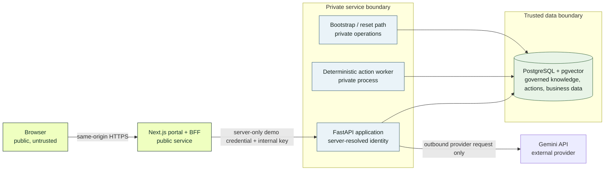
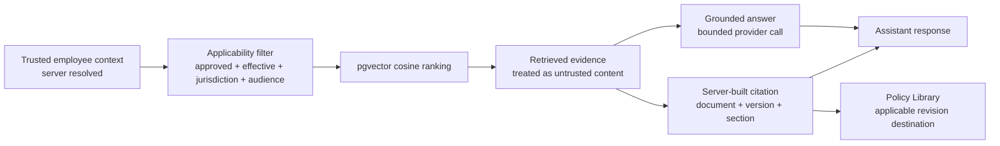
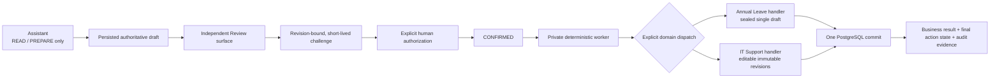

# Architecture and Trust Boundaries

This document describes the v1.0 release-candidate architecture. It is a production-minded portfolio prototype using synthetic business systems, not a production deployment blueprint.

## 1. System and trust boundary

Only the Next.js portal is public in the Render topology. The browser never receives backend demo-session values or the internal portal key. An HttpOnly persona cookie selects one of two fixed synthetic identities; FastAPI remains the authority that resolves the employee.

## 2. Governed knowledge flow

Filtering happens before ranking. Retrieved text never supplies identity or citation authority, and the provider cannot invent the citation object returned to the browser. The current governed demo baseline contains 13 synthetic documents and 47 chunks.

## 3. Action authorization and execution

Typing “yes” in chat cannot issue a challenge, confirm an action, or execute a mutation. The Review page obtains the persisted draft, and confirmation is bound to that action revision. The worker locks and revalidates before applying exactly one domain mutation inside the same PostgreSQL transaction as the final state and audit evidence.

Annual Leave and IT Support share control-plane invariants, not generic business logic. Annual Leave uses an employee advisory transaction lock to serialize leave mutations. IT Support relies on revision locking plus a unique `source_action_id` for exactly-one ticket creation. “Exactly once” here means exactly one business mutation inside this PostgreSQL transaction boundary; it is not a universal distributed-systems guarantee.

## Deployment shape

The production demo runs as four Render services backed by PostgreSQL 17 with pgvector:

- public Next.js portal/BFF;
- private FastAPI application;
- private action worker;
- private scheduled reset job.

See [Deployment](deployment.md) for reproducible configuration, readiness, reset, and rollback steps.
