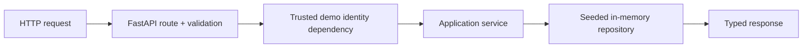

# V1 Implementation Notes

## What V1 added

- FastAPI and versioned REST endpoints
- Typed Pydantic API contracts and one safe error envelope
- Trusted synthetic demo identity
- Deterministic employee ownership enforcement
- Employee, IT, and chat services over one seeded read-only repository
- Offline API, identity, ownership, validation, and OpenAPI tests

## Architecture flow

The chat route follows `HTTP → FastAPI → ChatService → existing V0 Gemini client → validated
response`; it does not use employee data, tools, retrieval, or conversation memory.

## Key engineering decisions

- Identity is trusted context because authorization cannot safely depend on request bodies, prompts,
  or model output.
- Clients never submit `employee_id`; `/me/*` dependencies resolve it from `X-Demo-Session`.
- Ticket lookup takes both `ticket_id` and trusted `employee_id`. Cross-user and nonexistent tickets
  return the same public not-found response.
- Services keep HTTP concerns out of application behaviour, while the small repository keeps seeded
  data access and ownership filtering out of routes.
- PostgreSQL, RAG, embeddings, agents, and write workflows remain deferred until their approved
  milestones.

## Verification

- `uv run pytest`: **42 passed** (23 V0 + 19 V1)
- `uv run ruff check .`: **passed**
- `uv run ruff format --check .`: **passed**
- OpenAPI schema and Swagger UI smoke checks: **passed**

## Manual Validation

Manual validation was performed on **2026-08-24** and passed.

- Swagger UI at `/docs` loaded successfully and exposed the V1 API surface.
- `GET /api/v1/health` returned HTTP 200 with `status: ok`,
  `service: enterprise-ai-knowledge-action-agent`, and `milestone: V1`.
- `GET /api/v1/me/profile` with Alex's trusted demo session returned HTTP 200 with
  `employee_id: EMP-1001` and `full_name: Alex Morgan`.
- A client identity override attempt using
  `GET /api/v1/me/profile?employee_id=EMP-1002` while authenticated as Alex still returned
  `EMP-1001` / `Alex Morgan`. This confirms identity is resolved server-side and is not
  client-controlled.
- Alex queried their own ticket `TKT-1001` successfully.
- Alex queried another employee's ticket `TKT-2001` and received HTTP 404 with
  `error_code: ticket_not_found` and the public message
  `"The requested ticket was not found."`.
- Alex queried nonexistent ticket `TKT-9999` and received HTTP 404 with the same error code and
  public message as the cross-user request. Request IDs were intentionally different. This
  confirms non-revealing ownership enforcement.
- `GET /api/v1/me/leave/balances` returned annual = 76.0 hours and personal = 38.0 hours for
  Alex's session, and annual = 48.0 hours and personal = 24.0 hours for Sam's session. This
  confirms employee-scoped data is selected from trusted session context without accepting
  `employee_id` from the client.
- A real Gemini-backed `POST /api/v1/chat` call was made through the FastAPI endpoint with the
  question `"My payroll portal password is not working. What should I do?"`. It returned HTTP 200
  with `category: it`, a structured text summary, `requires_action: false`, and
  `confidence: 0.95`. This was a real provider-backed smoke test, not a mocked response. The
  model-reported confidence value is not treated as a calibrated probability, and the exact
  generated summary is not required to be deterministic.
- Portfolio evidence/screenshots were manually captured for Swagger/API health, the trusted
  profile response, the real Gemini-backed chat response, and the identical cross-user and
  nonexistent-ticket 404 behavior.
