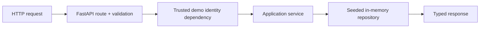

# V1 Implementation Notes

## What V1 added

- FastAPI and versioned REST endpoints
- Typed Pydantic API contracts and one safe error envelope
- Trusted synthetic demo identity
- Deterministic employee ownership enforcement
- Employee, IT, and chat services over one seeded read-only repository
- Offline API, identity, ownership, validation, and OpenAPI tests

## Architecture flow

The chat route follows `HTTP → FastAPI → ChatService → existing V0 Gemini client → validated
response`; it does not use employee data, tools, retrieval, or conversation memory.

## Key engineering decisions

- Identity is trusted context because authorization cannot safely depend on request bodies, prompts,
  or model output.
- Clients never submit `employee_id`; `/me/*` dependencies resolve it from `X-Demo-Session`.
- Ticket lookup takes both `ticket_id` and trusted `employee_id`. Cross-user and nonexistent tickets
  return the same public not-found response.
- Services keep HTTP concerns out of application behaviour, while the small repository keeps seeded
  data access and ownership filtering out of routes.
- PostgreSQL, RAG, embeddings, agents, and write workflows remain deferred until their approved
  milestones.

## Verification

- `uv run pytest`: **41 passed** (23 V0 + 18 V1)
- `uv run ruff check .`: **passed**
- `uv run ruff format --check .`: **passed**
- OpenAPI schema and Swagger UI smoke checks: **passed**
